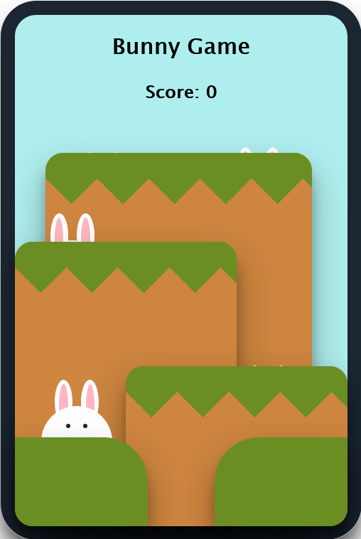

# BunnyGame
Animación en CSS3 y propiedad counter 

## Table of contents

- [Overview](#overview)
  - [Screenshot](#screenshot)
  - [Links](#links)
- [My process](#my-process)
  - [Built with](#built-with)
  - [What I learned](#what-i-learned)
  - [Useful resources](#useful-resources)
- [Author](#author)

## Overview

### Screenshot

### Links

- Live Site URL: [https://bunnygamemdp.netlify.app]

## My process

### Built with

- Semantic HTML5 markup
- CSS custom properties
- CSS Grid
- CSS Animation
- CSS counter properties

### What I learned

Aprendí a utilizar las animaciones de CSS3, a crear dibujos simples con div y a utilizar la propiedad counter, que te permite similares funciones (más limitadas obvio) que JavaScript. 
También aprendí a hacer patterns en CSS3

### Useful resources

- [https://www.magicpattern.design/tools/css-backgrounds] Me ayudó a generar el pattern y tiene otros que se pueden aprovechar

## Author

- Twitter - [https://www.twitter.com/Romitauber1]

